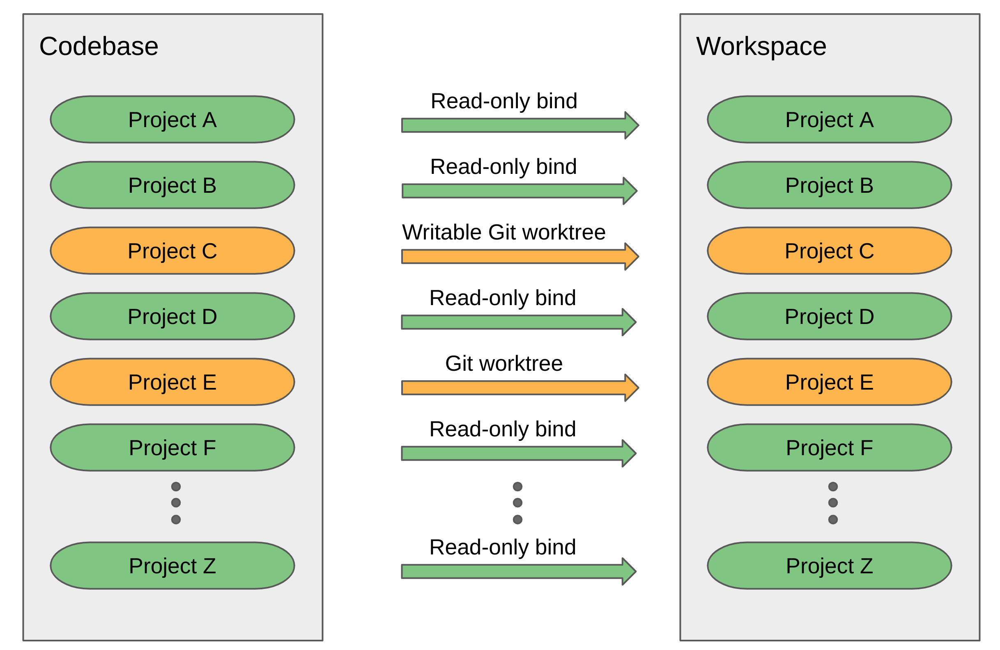

# hacksaw

**HACK** in a **S**peedy **A**ccess **W**orkspace

## What is Hacksaw?

If you have a large multi-gigabyte codebase spread out through multiple git projects it can take a long time branch off a clean workspace. Hacksaw is a tool that
lets you split off a clean workspace in seconds. It does so by only copying git projects that you
explicitly select to be edited. All other projects are read-only bind mounts. This lets you build without cloning the full codebase to a new location!

## How much faster is it, really?

Lets compare the performance of creating a hacksaw workspace versus a full repo sync using as a codebase the AOSP master branch as of 2020-8-4. The machine used was a c2-standard-60 Google Cloud Platform VM with 60 vCPUs and 240 GiB of RAM. Each action was performed at least 10 times then averaged out.

* Create a new full repo workspace [using a fresh local mirror](https://source.android.com/setup/build/downloading#using-a-local-mirror)
  + Time: 12 min 32 sec
  + Disk usage: 88 GiB

* Remove a full repo workspace with no build artifacts
  + Time: 28 seconds

* Create a new Hacksaw workspace
  + Time: 0.4 sec
  + Disk usage: 7.9 MiB

* Remove a Hacksaw workspace with no edits or build artifacts.
  + Time: 0.6 sec

* Create a new Hacksaw workspace and edit build/make project.
  + Time: 0.6 sec
  + Disk usage: 18 MiB

* Create a new Hacksaw workspace and edit frameworks/base project.
  + Time: 7.5 sec
  + Disk usage: 1.3 GiB

As you can see, the time it takes to set up a new workspace is proportional to
the git projects checked out for editing.

## Can you give me an example?

```
$ hacksaw codebase add super-large-codebase ~/super-large-codebase
$ hacksaw codebase set-default super-large-codebase
$ hacksaw workspace new big-feature
Created my-hot-new-feature on super-large-codease at ~/hacksaw/my-hot-new-feature
$ hacksaw edit ~/hacksaw/big-feature/projectA/new-module.go
Created branch my-hot-new-feature on project ~/hacksaw/my-hot-new-feature/projectA for editing
$ vim ~/hacksaw/my-hot-new-feature/projectA/new-module.go
$ hacksaw workspace new quick-fix
Created my-quick-fix on super-large-codebase at ~/hacksaw/my-quick-fix
$ hacksaw edit ~/hacksaw/my-quick-fix/projectB
$ vim ~/hacksaw/my-quick-fix/projectB/core-module.go
$ ~/hacksaw/my-quick-fix/buid-and-run-tests.sh
$ git -B /hacksaw/my-quick-fix/path/to/projectB/ commit -a -m "Quick fix"
$ git -B /hacksaw/my-quick-fix/path/to/projectB/ push origin
$ vim ~/hacksaw/my-hot-new-feature/projectA/new-module.go
```

## How do I install it?

Building hacksaw requires [golang to be installed](https://golang.org/doc/install).
To install the hacksaw client run the following:

```
go get android.googlesource.com/platform/tools/treble.git/hacksaw
go install android.googlesource.com/platform/tools/treble.git/hacksaw/cmd/hacksaw
```

This will install hacksaw to ~/go/bin/hacksaw. You may choose to copy that
to a location in your path. For example:

```
sudo cp ~/go/bin/hacksaw /usr/local/bin
sudo chmod 755 /usr/local/bin/hacksaw
```

## How do I make sure that creating a hacksaw workspace is fast?

Hacksaw creates bind mounts for all git projects in a codebase. It then
copies **everything** else. Make sure you remove all build artifacts from a
codebase before create a workspace, otherwise it may spend a long time copying
them.

## How do I run it with sudo?

Commands that mount and unmount will require sudo. That includes commands like

* `hacksaw workspace new`
* `hacksaw edit`
* `hacksaw workspace remove`

Other commmands like `hacksaw workspace list` or `hacksaw add codebase` do not
mount or unmount so do not require sudo.

There are two ways to avoid using sudo to run hacksaw: mount namespaces and
hacksawd. Both are explained below.

## How do I run it without sudo?

Hacksaw relies heavily on bind mounts which normally requires privileged
access. One option is to use [mount
namespaces](https://lwn.net/Articles/689856/) which allow you to create mounts
without privileged access:

```
unshare --map-root-user --mount /bin/bash
hacksaw workspace new my-workspace my-codebase
```

Note that mount namespaces are only visible from the process that
created it. So if you issue the commands above the resulting workspace
will only be fully visible from that shell and no other shell terminals
or windows. That may work fine for editing and building from the terminal
but it may not work if, for example, you use an IDE for editing unless
that IDE window is launched from the process that created the workspace.

If you would like for your workspace to be visible by the whole system then
there are two options: using sudo or installing hacksawd.

## What is hacksawd?

Hacksawd is a privileged system daemon whose only job is to manage bind mounts.
The provided install script will install to your system

```
go install android.googlesource.com/platform/tools/treble.git/hacksaw/cmd/hacksawd
sudo cp ~/go/bin/hacksawd /usr/local/bin
sudo chmod 755 /usr/local/bin/hacksawd
sudo ~/go/src/android.googlesource.com/platform/tools/treble.git/hacksaw/scripts/install-service.sh
```

The installation scripts creates a new "hacksaw" group and adds you to it. You
will need to log out and log back in for the group changes to take effect. After that you should be able to run any hacksaw command without sudo.

If you wish to uninstall the service then run:

```
sudo ~/go/src/android.googlesource.com/platform/tools/treble.git/hacksaw/scripts/uninstall-service.sh
sudo rm /usr/local/bin/hacksawd
```

## How does hacksaw work?

Hacksaw uses read-only bind mounts to create project references from
a workspace to a codebase. When you mark a project for editing then
its read-only bind mount gets replaced by a writable Git worktree.




## What are the known issues?

* The "default codebase" option can't be used for creating workspaces yet.
* Some repo commands don't work yet. Namely: `repo start` and `repo upload`.
  So at the moment you can only upload to Gerrit [using git
  push](https://gerrit-review.googlesource.com/Documentation/user-upload.html#_git_push).
* Failing to create a workspace is not rolled back.
* Editing nested projects is not supported yet. So if you have a git project
  that contains other git projects you will get some unexpected behaviour.
* Git submodules are not supported yet, but the tool is designed with
  future git submodule support in mind.
* Workspace creation and deletion with sudo or hacksawd slows down
  when there are more concurrent active workspaces. This is not an issue if
  you use mount namespaces (unshare -rm /bin/bash).
* Syncing a codebase does update the existing projects in all attached
  workspaces but it does not remove or add new projects. Perhaps there
  should be a new "workspace sync" command for that?
* Removing a workspace retains the any git worktree branches in the
  codebase. And if you create the a workspace with the same name then
  try to edit a project that has been edited before, you will get a
  worktree name conflict.
